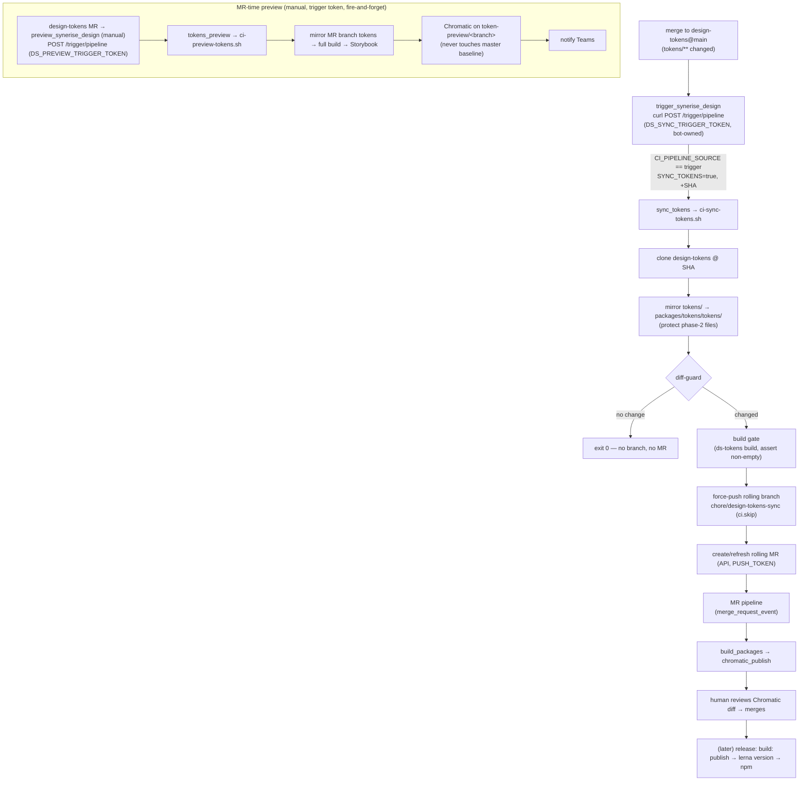

# 1. Design token sync flow (design-tokens → synerise-design)

- **Status:** Accepted
- **Date:** 2026-06-08
- **Deciders:** Design System / Frontend
- **Scope:** `Frontend/design-tokens` (source) and `Frontend/synerise-design` (this repo, project id `1171`)

> Operational runbook lives in [`packages/tokens/SYNC_AUTOMATION.md`](../../packages/tokens/SYNC_AUTOMATION.md).
> This ADR records *why* the flow is shaped the way it is; that doc records *how* to run and verify it.

## Context

Design tokens are authored in a separate repo, `Frontend/design-tokens`. The design system
consumes them as the `@synerise/ds-tokens` package inside this monorepo. We need token changes
to reach the design system **automatically**, be **visually reviewed** before they land, and
**not** trigger a package publish on their own.

Constraints that shaped the decision:

- Two repos, two pipelines, on a self-managed GitLab (`gitlab.synerise.com`).
- Tokens must be reviewed visually (Chromatic) — a JSON diff is not enough to catch regressions.
- Publishing `@synerise/ds-tokens` is a deliberate release step (`build: publish` → `lerna version`
  → npm); a token sync must never piggy-back a publish.
- The sync must fire **regardless of which person merges** in `design-tokens` — see decision 6,
  which supersedes the original `trigger:`-keyword approach.
- The token build must tolerate partial/drifted upstream content without hard-failing.

## Decisions

### 1. Canonical source is `design-tokens@main`; automation is merge-triggered in CI

Token JSON lives on `main` in `design-tokens` (`master` is retired, carrying only the
Secret-Detection template). A merge to `main` that touches `tokens/**` is the single event that
starts a sync. No scheduled polling, no manual copy.

The merged **commit SHA** is forwarded downstream (`TRIGGER_SOURCE_SHA`) so the worker clones the
*exact* merged state — two merges landing back-to-back cannot race into a mixed tree.

### 2. One rolling MR, force-updated per change

The worker force-pushes a single rolling branch `chore/design-tokens-sync` and creates **or
refreshes** one open MR against `master`. The reviewer always sees "current tokens vs master" in
one Chromatic thread instead of a pile of one-shot MRs. The MR is created with `squash: true` and
`remove_source_branch: true`.

### 3. The sync MR never bumps the package version

The sync commit/MR title is `chore(tokens): sync from design-tokens@<sha>`, deliberately **not**
`build: publish`. Merging it does not fire `publish_packages`. The next normal release picks up the
changed package files and publishes. Versioning stays with the existing release flow.

### 4. Mirror in Node, with protected repo-local files

`scripts/ci-sync-tokens.sh` mirrors `tokens/` → `packages/tokens/tokens/` using a small Node copy
(no `rsync`/`curl`/`jq` dependency — guaranteed available in the build image). It mirrors upstream
*removals* too, **except** phase-2 files that exist only here and must not be deleted:
`semantic/dimensions.json`, `semantic/spacing.json`, `modules/colors-only.json`.

### 5. Two safety gates before a branch is ever opened

- **Diff-guard:** if the mirror produces no change under `packages/tokens/tokens`, the job exits 0
  — no branch, no MR. (A docs-only commit upstream is additionally filtered by `changes: tokens/**`.)
- **Build gate:** `@synerise/ds-tokens` is rebuilt (`pnpm --filter @synerise/ds-tokens build`).
  `config/build-tokens.mjs` prunes unresolvable references to a fixpoint and **asserts non-empty
  `--ds-color-` output**, so a broken/empty build fails the job instead of opening a broken MR.
  Drifted tokens surface as absent vars in the Chromatic diff plus a prune-count warning — never a
  hard failure.

### 6. Trigger via a bot-owned **pipeline trigger token**, not the `trigger:` keyword

> This decision **supersedes** the original `trigger:`-keyword design still shown in
> `SYNC_AUTOMATION.md` §A.

The `trigger:` keyword creates the downstream pipeline **on behalf of the user who merged** in
`design-tokens`. That user must hold ≥ Developer on `synerise-design` and be allowed to run a
pipeline on the target ref — so the sync failed whenever someone without that access merged
(observed: a maintainer merge failed on permissions). It is inherently per-person.

Instead, `design-tokens`' `trigger_synerise_design` job calls the trigger API
(`POST /projects/Frontend%2Fsynerise-design/trigger/pipeline`) with a **pipeline trigger token**
stored as the masked + protected CI/CD variable `DS_SYNC_TRIGGER_TOKEN`. Token-triggered pipelines
run under the **token owner's** identity, not the merger's — so any merge to `main` works regardless
of who performs it.

The token must be **bot-owned** (a project access token / service account on `synerise-design`),
not owned by an individual, so the flow survives that person losing access or leaving. Trigger
tokens have no owner picker; a bot-owned one is created by calling `POST /projects/:id/triggers`
while authenticated *as the bot* (e.g. with a `synerise-design` project access token).

Consequence for the downstream rules: token-triggered pipelines have
`CI_PIPELINE_SOURCE == "trigger"` (the keyword produced `"pipeline"`). The `sync_tokens` and
`tokens_preview` rules therefore accept both: `$CI_PIPELINE_SOURCE =~ /^(pipeline|trigger)$/`.

### 7. MR-time preview path (manual), also via a trigger token

`design-tokens` exposes a manual `preview_synerise_design` job on its MRs. It triggers
`tokens_preview` here, which runs `scripts/ci-preview-tokens.sh`: mirror the MR branch's tokens
(`MIRROR_ONLY` reuse of the sync worker) → full `pnpm build` → build Storybook (TurboSnap disabled,
since a token change reaches Storybook through the build, not a traced story import) → publish
Chromatic on an isolated `token-preview/<branch>` branch (so the diff shows against the master
baseline but never updates it) → notify Teams. No branch push, no MR.

For the same reason as decision 6, this job uses a **pipeline trigger token**, not the `trigger:`
keyword: the keyword runs the preview as the MR author, who may lack `synerise-design` access, so
anyone's MR could fail to preview. The token makes the preview runnable by anyone with an MR here.

Because MR pipelines run on **unprotected feature branches**, where *protected* CI/CD variables are
not exposed, the preview token must be a **separate, masked but non-protected** variable
(`DS_PREVIEW_TRIGGER_TOKEN`) — it cannot reuse the protected `DS_SYNC_TRIGGER_TOKEN`. Keeping the
two tokens distinct also lets the higher-exposure preview token be revoked independently.

Trade-off: a trigger token can't do `strategy: depend`, so the preview job is now fire-and-forget
(it goes green once the downstream pipeline is created) rather than blocking on and surfacing the
result. The Chromatic build + Storybook links instead reach the MR author through the Teams
notification that `ci-preview-tokens.sh` sends at the end.

## Tokens and identities

| Variable | Where | Purpose |
|----------|-------|---------|
| `DS_SYNC_TRIGGER_TOKEN` | `design-tokens` (masked + protected) | Bot-owned trigger token used by the main-branch sync to start the sync pipeline here |
| `DS_PREVIEW_TRIGGER_TOKEN` | `design-tokens` (masked, **not** protected) | Bot-owned trigger token used by the manual MR preview; non-protected so it is exposed on unprotected MR branches (decision 7) |
| `TOKENS_REPO_READ_TOKEN` | `synerise-design` (masked) | `read_repository` token on `design-tokens` to clone the source @ SHA. Falls back to `CI_JOB_TOKEN` (then `design-tokens` must allowlist project 1171) |
| `PUSH_TOKEN` | `synerise-design` (masked) | `write_repository` + `api` token to force-push the rolling branch and create/refresh the MR |
| `CHROMATIC_PROJECT_TOKEN_SB7` | `synerise-design` (existing) | Chromatic project token for preview/publish |

Job-token allowlist: `synerise-design` → *Settings → CI/CD → Token Access* must include
`Frontend/design-tokens`. All tokens carry expiry + rotation reminders.

## End-to-end flow

## Consequences

**Positive**

- Sync fires for any merge to `design-tokens@main` regardless of who merges (decision 6).
- Survives personnel changes once the trigger token is bot-owned.
- Every token change is visually reviewed in Chromatic before it can land.
- No accidental publishes; releases stay deliberate.
- No spurious MRs/branches (diff-guard + build gate); back-to-back merges don't race (SHA pinning).
- Token build tolerates partial/drifted upstream instead of hard-failing CI.

**Negative / trade-offs**

- A token-triggered pipeline is **not** a natively linked child pipeline: both the sync and the
  preview lose `strategy: depend` and the upstream↔downstream graph link. The sync is
  fire-and-forget by nature; the preview surfaces its Chromatic result via the Teams notification
  instead of the MR widget.
- The downstream rules still accept both `trigger` and `pipeline` sources (`=~
  /^(pipeline|trigger)$/`) so the flow keeps working if any job is reverted to the keyword. Easy to
  forget when editing rules.
- Several long-lived tokens to rotate (`DS_SYNC_TRIGGER_TOKEN`, `DS_PREVIEW_TRIGGER_TOKEN`,
  `TOKENS_REPO_READ_TOKEN`, `PUSH_TOKEN`). Bot ownership concentrates blast radius on the bot
  account; the non-protected preview token is the most exposed (readable on any MR branch).
- **Temporary:** both the trigger `ref` and the sync MR target are pointed at `chore/tokenisation`
  for verification and must be reverted to `master` once verified. When on the protected `master`,
  the trigger token's bot owner must be allowed to run pipelines on it.

## Alternatives considered

- **Keep the `trigger:` keyword, grant every merger Developer on `synerise-design`.** Rejected —
  still per-person; breaks the moment a new merger lacks access.
- **`POST /projects/:id/pipeline` with a project access token (`PRIVATE-TOKEN`).** Also bot-owned,
  but produces `CI_PIPELINE_SOURCE == "api"` and is a heavier credential than a scoped trigger
  token. A trigger token is the narrowest tool for the job.
- **Publish `@synerise/ds-tokens` directly from the sync (no MR).** Rejected — removes the human
  Chromatic review gate and couples token edits to releases.
- **Scheduled poll / mirror cron.** Rejected — adds latency and races; merge-trigger is exact.
